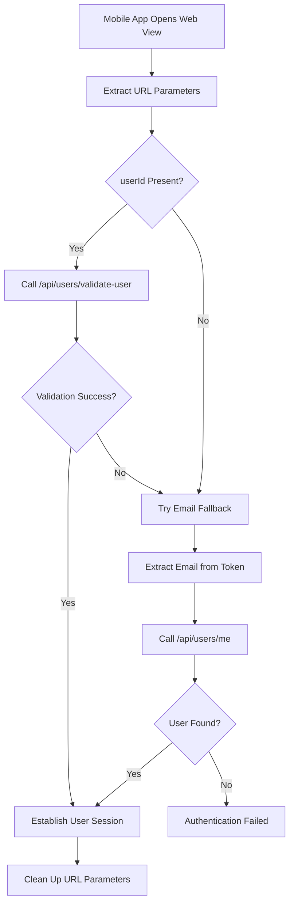

# Mobile App Authentication

## Overview

The mobile app authentication system enables seamless user authentication when users access the React Web application through the mobile app's web view. This system supports both userId-based validation and email-based fallback authentication methods.

## Problem Solved

Previously, mobile app users experienced authentication failures when accessing the web app because the system was incorrectly detecting Supabase user IDs instead of platform user IDs. This implementation provides:

1. **Direct User Validation**: Validates the mobile app's provided userId against the authentication token
2. **Fallback Mechanism**: Falls back to email-based user lookup if userId validation fails
3. **Seamless Session Management**: Automatically establishes user sessions without manual intervention
4. **User Switching Support**: Handles scenarios where different users access the same browser session

## URL Parameters

The mobile app passes authentication information via URL parameters:

```
https://your-web-app.com/any-page?token=JWT_TOKEN&userId=USER_ID&mobile=true
```

### Parameters:
- `token` (required): JWT authentication token from the mobile app
- `userId` (required): Platform user ID to validate against the token
- `mobile` (optional): Flag indicating mobile app browser detection

## Authentication Flow

### 1. Primary Method: UserId Validation

When both `token` and `userId` parameters are present:



### 2. Fallback Method: Email-Based Lookup

If userId validation fails or userId is not provided:

1. Extract email from JWT token payload
2. Call `/api/users/me` with Bearer token authentication
3. Retrieve user data from backend
4. Establish session if user is found

## API Endpoints

### POST /api/users/validate-user

Validates a userId against a provided authentication token.

**Request:**
```json
{
  "userId": "user-id-from-mobile-app",
  "token": "jwt-token-from-mobile-app"
}
```

**Response (Success):**
```json
{
  "success": true,
  "user": {
    "id": "user-id",
    "firstName": "John",
    "lastName": "Doe",
    "email": "john@example.com",
    "accountId": "account-id"
  }
}
```

**Response (Failure):**
```json
{
  "success": false,
  "error": "User ID not valid for the provided token"
}
```

### Validation Logic

The validation endpoint performs the following checks:

1. **Token Validation**: Verifies the JWT token with the backend
2. **Direct Match**: Checks if userId directly matches the token user
3. **Account Association**: If no direct match, checks if userId belongs to the same account
4. **Error Handling**: Returns appropriate error messages for invalid combinations

## Implementation Details

### AuthContext Integration

The `AuthContext` automatically handles mobile app authentication:

```typescript
// URL parameter detection
const urlParams = new URLSearchParams(window.location.search);
const urlToken = urlParams.get('token');
const urlUserId = urlParams.get('userId');

// Primary authentication method
if (urlUserId) {
  const validationResult = await validateUserId(urlUserId, urlToken);
  if (validationResult.success) {
    establishSession(validationResult.user);
  }
}

// Fallback authentication method
if (!userData) {
  const tokenPayload = extractUserFromToken(urlToken);
  const userFromEmail = await fetchUserByEmail(tokenPayload.email);
  establishSession(userFromEmail);
}
```

### Session Management

Upon successful authentication:

1. **Token Storage**: Store auth and refresh tokens in localStorage and cookies
2. **User Data Storage**: Store user information in localStorage
3. **State Update**: Update React authentication state
4. **URL Cleanup**: Remove authentication parameters from URL
5. **Logging**: Log authentication method and user details

### User Switching

The system detects and handles user switching scenarios:

```typescript
const currentUser = getCurrentUser();
const newUser = authenticatedUser;

if (currentUser?.email !== newUser.email) {
  // Clear existing session
  clearAllStorage('User switch detected');
  
  // Reset authentication state
  setAuthState({ user: null, isAuthenticated: false });
  
  // Establish new session
  establishSession(newUser);
}
```

## Testing

### Test Page: `/test-auth`

The application includes a comprehensive test page for mobile app authentication:

**Features:**
- Test userId validation API endpoint
- Simulate mobile app URL generation
- Monitor authentication state changes
- View detailed console logs
- Clear test results

**Usage:**
1. Navigate to `/test-auth`
2. Click "Test UserId Validation API" to test the validation endpoint
3. Click "Simulate Mobile App URL with UserId" to generate test URLs
4. Monitor the authentication state display
5. Check browser console for detailed logs

### Manual Testing

**Test URL Format:**
```
/home?token=VALID_JWT_TOKEN&userId=VALID_USER_ID&mobile=true
```

**Test Steps:**
1. Obtain a valid JWT token and user ID from the mobile app
2. Navigate to the test URL in a browser
3. Verify authentication state updates correctly
4. Check that URL parameters are cleaned up
5. Confirm user session is established

### Console Logging

The system provides detailed console logs for debugging:

```
URL token detected, processing mobile app authentication...
UserId parameter detected, attempting userId validation...
UserId validation successful: { id: "user-123", email: "user@example.com" }
Mobile app authentication completed successfully using userId validation
```

## Error Handling

### Common Error Scenarios

1. **Invalid Token**: Token is expired or malformed
2. **Invalid UserId**: UserId doesn't match token or account
3. **Network Errors**: API calls fail due to connectivity issues
4. **Missing Parameters**: Required URL parameters are not provided

### Error Responses

The system provides clear error messages for troubleshooting:

- `"Invalid or expired token"`
- `"User ID not valid for the provided token"`
- `"Authentication failed: Could not validate user"`
- `"Internal server error during user validation"`

## Security Considerations

1. **Token Validation**: All tokens are validated against the backend
2. **User Association**: UserId validation ensures users can only access their own data
3. **Account Boundaries**: Cross-account access is prevented
4. **Session Security**: Tokens are stored securely with appropriate flags
5. **URL Cleanup**: Sensitive parameters are removed from browser history

## Troubleshooting

### Common Issues

1. **Authentication Fails**: Check token validity and user ID accuracy
2. **User Switch Not Detected**: Verify email comparison logic
3. **URL Parameters Persist**: Ensure cleanup logic executes properly
4. **Console Errors**: Check network connectivity and API responses

### Debug Mode

Enable debug logging by setting environment variable:
```
NEXT_PUBLIC_AUTH_DEBUG_MODE=true
```

This provides additional console output for troubleshooting authentication issues.
